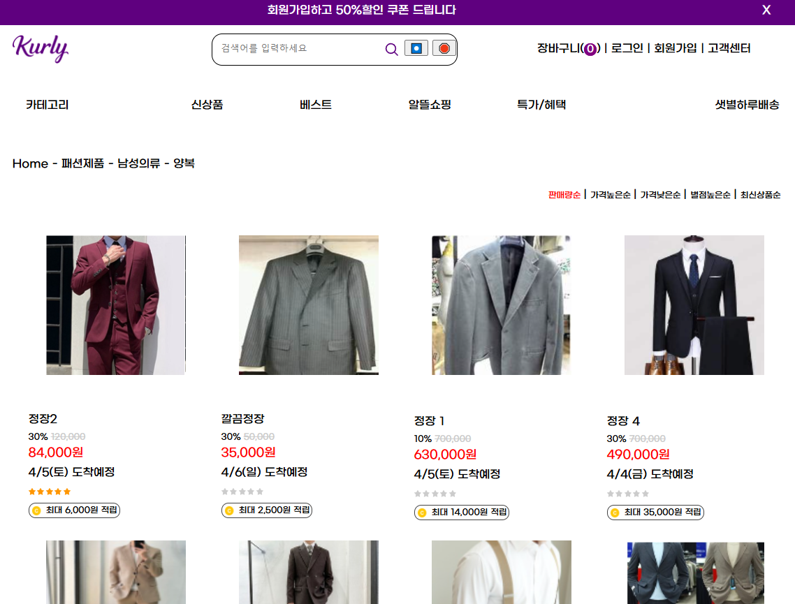
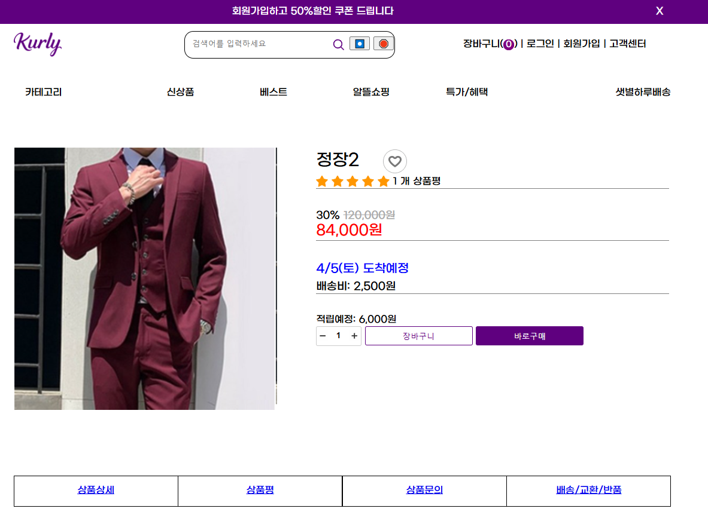

# 🛒 Spring-MyShop-Project

Spring Boot 기반 쇼핑몰 구현 프로젝트입니다.  
MyBatis와 JSP를 활용한 전통적인 MVC 패턴 구조로, 전자상거래 웹 서비스의 기본 흐름을 학습하고  
회원가입, 상품 목록, 장바구니, 주문 등 전반적인 기능을 직접 구현했습니다.

<div align="center">
  
  
  
  
  
  
</div>

## 📌 프로젝트 정보
- **진행 방식**: 개인 프로젝트
- **학습 목적**: 쇼핑몰 기능 전체 구현 및 Spring MVC 실전 적용 연습
- **개발 기간**: 2025년 1월 20일 ~ 2025년 2월 27일 (약 5주)

## 📷 화면 미리보기 (일부 예시 이미지)

<table>
  <tr>
    <td><p align="center"><strong>메인 화면</strong> - 신상품 및 추천 상품 표시</p></td>
    <td><p align="center"><strong>상품 목록</strong> - 카테고리별 필터링 및 정렬</p></td>
  </tr>
  <tr>
    <td><p align="center"><strong>장바구니</strong> - 실시간 수량 변경 및 금액 계산</p></td>
    <td><p align="center"><strong>주문 완료</strong> - 주문 상세 내역 및 결제 정보</p></td>
  </tr>
</table>

> 💡 **참고**: 전체 UI/UX는 사용자 친화적인 디자인 원칙을 적용했으며, 더 많은 화면은 프로젝트를 직접 실행하거나 코드를 통해 확인하실 수 있습니다.

## 🧰 사용 기술

| 구분        | 기술 스택                                             |
|-------------|-------------------------------------------------------|
| Language    | Java 17                                               |
| Framework   | Spring Boot 3.4.1, Spring MVC                         |
| View        | JSP, JSTL, SiteMesh                                  |
| ORM         | MyBatis                                              |
| DBMS        | MariaDB                                              |
| Mail        | JavaMail (javax.mail), Activation API                 |
| Build Tool  | Maven                                                |
| 기타        | Lombok, Spring DevTools, GitHub                       |

## 🔍 프로젝트 구조

```
src/main
├── java/com/example/myshop
│   ├── config/          # 애플리케이션 설정 클래스
│   │   ├── SiteMeshConfig.java    # SiteMesh 레이아웃 설정
│   │   └── WebMvcConfig.java      # 웹 MVC 설정
│   ├── controller/      # MVC 컨트롤러
│   │   ├── AdminController.java   # 관리자 기능 컨트롤러
│   │   ├── CartController.java    # 장바구니 기능 컨트롤러
│   │   ├── MemberController.java  # 회원 관련 컨트롤러
│   │   ├── OrderController.java   # 주문 처리 컨트롤러
│   │   └── ProductController.java # 상품 관련 컨트롤러
│   ├── mapper/          # MyBatis 매퍼 인터페이스
│   │   ├── CartMapper.java        # 장바구니 데이터 매퍼
│   │   ├── MemberMapper.java      # 회원 데이터 매퍼
│   │   ├── OrderMapper.java       # 주문 데이터 매퍼
│   │   └── ProductMapper.java     # 상품 데이터 매퍼
│   ├── model/           # 도메인 모델 클래스
│   │   ├── Cart.java             # 장바구니 모델
│   │   ├── Member.java           # 회원 모델
│   │   ├── Order.java            # 주문 모델
│   │   ├── OrderItem.java        # 주문 상품 모델
│   │   └── Product.java          # 상품 모델
│   ├── service/         # 비즈니스 로직 서비스
│   │   ├── CartService.java      # 장바구니 서비스
│   │   ├── EmailService.java     # 이메일 발송 서비스
│   │   ├── MemberService.java    # 회원 서비스
│   │   ├── OrderService.java     # 주문 서비스
│   │   └── ProductService.java   # 상품 서비스
│   └── util/            # 유틸리티 클래스
│       ├── FileUploadUtil.java   # 파일 업로드 유틸
│       └── SessionUtil.java      # 세션 관리 유틸
├── resources
│   ├── mapper/          # XML 매퍼 파일
│   │   ├── cartMapper.xml        # 장바구니 SQL 매핑
│   │   ├── memberMapper.xml      # 회원 SQL 매핑
│   │   ├── orderMapper.xml       # 주문 SQL 매핑
│   │   └── productMapper.xml     # 상품 SQL 매핑
│   ├── static/          # 정적 리소스
│   │   ├── css/                  # 스타일시트
│   │   ├── js/                   # 자바스크립트
│   │   └── images/               # 이미지 파일
│   └── application.properties    # 애플리케이션 설정
└── webapp/WEB-INF/views/  # JSP 뷰 템플릿
    ├── admin/           # 관리자 화면
    ├── cart/            # 장바구니 화면
    ├── layout/          # SiteMesh 레이아웃
    ├── member/          # 회원 관련 화면
    ├── order/           # 주문 관련 화면
    ├── product/         # 상품 관련 화면
    └── index.jsp        # 메인 페이지
```

## 🔧 주요 기능 구현

### ✅ 회원 기능
- 회원가입 (중복 체크, 유효성 검사)
- 로그인 / 로그아웃
- 마이페이지 (주문내역 조회)
- 세션 기반 사용자 인증

### ✅ 상품 기능
- 상품 등록 / 수정 / 삭제 (관리자)
- 상품 리스트 (카테고리별, 정렬)
- 상품 상세 페이지
- 상품 검색 및 필터링

### ✅ 장바구니 기능
- 상품 장바구니에 담기 / 삭제 / 수량 변경
- 장바구니 목록 보기 (로그인 사용자별)
- 비로그인 사용자 세션 장바구니 지원

### ✅ 주문 기능
- 주문서 작성 (배송 정보, 적립금 사용)
- 배송비 계산
- 주문 완료 처리
- 결제 수단 선택 (카드, 무통장입금 등)

### ✅ 기타 기능
- 이메일 발송 기능 (JavaMail)
- 공통 레이아웃 구성 (SiteMesh)
- JSTL 기반 템플릿 구성
- 마이바티스 매퍼 기반 DAO 구조
- 찜하기 기능

## 📊 데이터베이스 설계

### 데이터베이스 ERD
```
+-----------+     +----------+     +----------+
|   member  |     |  product |     |  company |
+-----------+     +----------+     +----------+
| id (PK)   |     | id (PK)  |     | id (PK)  |
| userid    |     | pcode    |     | name     |
| pwd       |     | title    |     | code     |
| email     |     | price    |     +----------+
| name      |     | halin    |           |
| phone     |     | su       |           |
| state     |     | baeprice |           |
| juk       |     | star     |     +-----v---+
+-----------+     | company_ |     |   dae   |
     |             | code     |     +---------+
     |             +----------+     | id (PK) |
     |                   |          | name    |
     |                   |          | code    |
     |                   |          +---------+
     |                   |               |
     v                   v               v
+-----------+     +-----------+     +---------+
|   cart    |     |   jjim    |     |  jung   |
+-----------+     +-----------+     +---------+
| id (PK)   |     | id (PK)   |     | id (PK) |
| userid    |     | pcode     |     | name    |
| pcode     |     | userid    |     | code    |
| su        |     | writeday  |     | daecode |
| writeday  |     +-----------+     +---------+
+-----------+                            |
     |                                   v
     |                              +---------+
     |                              |   so    |
     v                              +---------+
+-----------+                       | id (PK) |
|   gumae   |                       | name    |
+-----------+                       | code    |
| id (PK)   |                       | daejung |
| userid    |                       +---------+
| baeId     |
| pcode     |                       +---------+
| su        |                       | baesong |
| useJuk    |                       +---------+
| jumuncode |                       | id (PK) |
| state     |                       | zip     |
| writeday  |                       | juso    |
| sudan     |                       | phone   |
+-----------+                       | name    |
     |                              | userid  |
     v                              +---------+
+-----------+
|  review   |
+-----------+
| id (PK)   |
| userid    |
| pcode     |
| star      |
| title     |
| content   |
| writeday  |
+-----------+
```

### 상품 분류 체계
상품은 대분류(dae) → 중분류(jung) → 소분류(so) 계층 구조로 관리됩니다.

- **상품 코드 (pcode)** 체계: `p + 대분류코드 + 중분류코드 + 소분류코드 + 일련번호`
  - 예: `p01010103005` = 가전제품(01) > TV(01) > 소형TV(03) > 일련번호(005)

### 주요 테이블 구조

#### 1. member (회원 정보)
- 기본 계정 정보 (userid, pwd, email)
- 개인 정보 (name, phone)
- 상태 관리 (state)
- 적립금 (juk)

#### 2. product (상품 정보)
- 상품 기본 정보 (pcode, title, price)
- 재고 관리 (su)
- 할인 정보 (halin)
- 이미지 정보 (pimg, dimg)
- 평점 관리 (star)

#### 3. cart (장바구니)
- 사용자별 장바구니 상품 (userid, pcode)
- 수량 및 등록일 관리 (su, writeday)

#### 4. gumae (주문/구매 정보)
- 주문 기본 정보 (주문코드, 상태)
- 주문 상품 및 수량 (pcode, su)
- 결제 관련 정보 (useJuk, sudan)
- 배송 연결 정보 (baeId)

#### 5. baesong (배송 정보)
- 배송지 정보 (zip, juso, jusoEtc)
- 수령인 정보 (name, phone)
- 기본 배송지 여부 (gibon)

## 📘 학습 노트 (Notion)
국비지원 학원 수강 중 작성한 **학습 정리 노트**입니다.  
개념 요약, 실습 코드, 오류 해결 경험 등을 정리했습니다.  
👉 [Notion 정리 보기](https://www.notion.so/183fec60ac96800a892fe328e0e980ef)

## 🛠 개발 환경
- IDE: Spring Tool Suite 4 (STS4)
- 서버: Apache Tomcat 10 (내장형)
- 버전 관리: Git, GitHub
- 데이터베이스 툴: DBeaver, HeidiSQL

## 🚀 실행 방법

```bash
# 1. 프로젝트 클론
git clone https://github.com/MeronaKiller/spring-myshop-project.git

# 2. STS4 또는 IntelliJ에서 Import → Maven Project

# 3. DB 연동 정보 설정 (application.properties)
# 예시: jdbc:mariadb://localhost:3306/myshop

# 4. SQL 스크립트 실행하여 DB 스키마 및 초기 데이터 생성

# 5. 내장형 Tomcat 10으로 서버 실행
```

## 📝 프로젝트 특징 및 학습 포인트

### 1. 계층형 카테고리 관리 시스템
- 대분류-중분류-소분류로 연결되는 체계적인 카테고리 구조
- 상품 코드 체계를 활용한 효율적인 상품 관리
- 계층별 카테고리 조회 및 필터링 기능

### 2. MyBatis를 활용한 데이터 접근 계층
- 동적 SQL을 활용한 상품 검색 및 필터링
- 복잡한 조인 쿼리 최적화
- Result 매핑으로 객체 관계 구현

### 3. 세션 기반 사용자 인증 및 장바구니
- 로그인/비로그인 상태 장바구니 통합 관리
- 세션을 활용한 사용자 상태 유지
- 효율적인 장바구니 데이터 관리

### 4. SiteMesh를 활용한 레이아웃 관리
- 공통 헤더, 푸터, 네비게이션 레이아웃 적용
- 중복 코드 제거로 유지보수성 향상
- 페이지별 템플릿 일관성 유지

### 5. 이메일 서비스
- JavaMail API를 활용한 HTML 이메일 발송
- 회원가입 확인, 주문 확인 등 다양한 알림 구현

## 👨‍💻 개발자 정보

**MeronaKiller**
- GitHub: [github.com/MeronaKiller](https://github.com/MeronaKiller)
