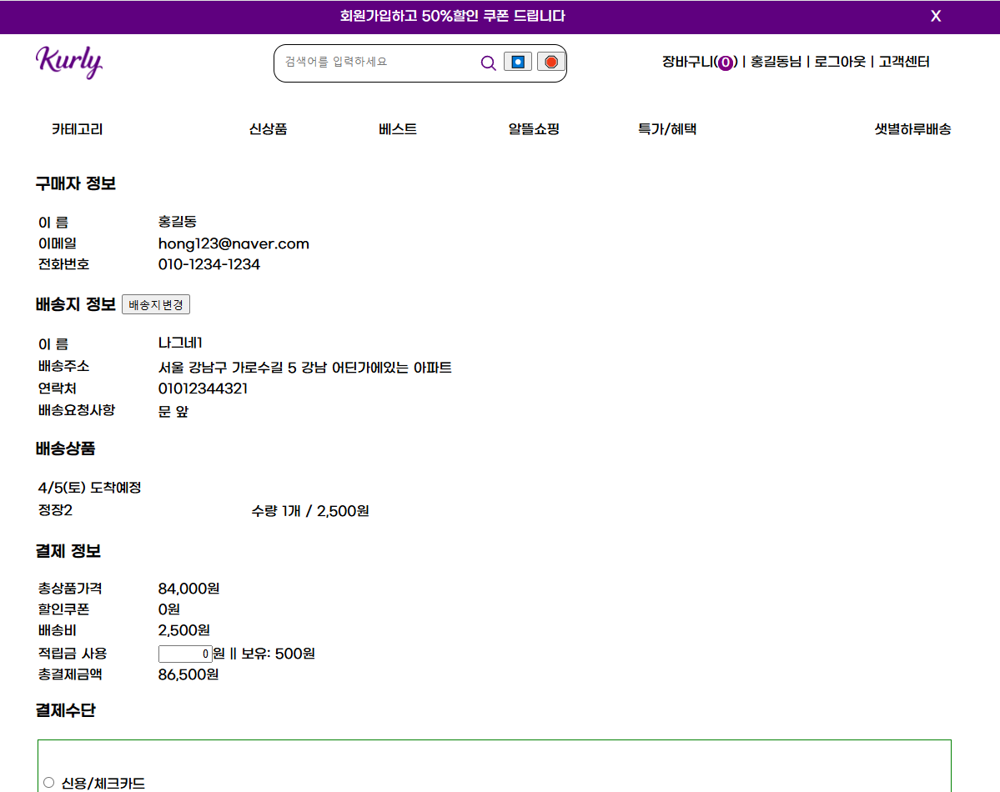

# 🛍️ Spring-MyShop-Project

<div align="center">
  
  [](https://www.oracle.com/java/)
  [](https://spring.io/projects/spring-boot)
  [](https://mybatis.org/mybatis-3/)
  [](https://mariadb.org/)
  [](https://www.oracle.com/java/technologies/jspt.html)
  [](https://maven.apache.org/)
  
  **✨ MyBatis & JSP 기반 쇼핑몰 플랫폼 ✨**
  
  *전자상거래의 모든 핵심 기능을 갖춘 풀스택 프로젝트*
</div>

## 🎯 프로젝트 개요

**Spring-MyShop**은 Spring Boot 기반으로 구현된 온라인 쇼핑몰 플랫폼입니다. MyBatis와 JSP를 활용한 전통적인 MVC 아키텍처를 바탕으로, 사용자 친화적인 쇼핑 경험을 제공합니다. 회원 관리부터 상품 카탈로그, 장바구니, 주문 처리까지 전자상거래의 전체 라이프사이클을 구현했습니다.

<div align="center">
  <table>
    <tr>
      <td align="center"><b>🗓️ 개발 기간</b></td>
      <td align="center">2025.01.20 ~ 2025.02.27 (약 5주)</td>
    </tr>
    <tr>
      <td align="center"><b>👨‍💻 개발 방식</b></td>
      <td align="center">개인 프로젝트</td>
    </tr>
    <tr>
      <td align="center"><b>📚 학습 목표</b></td>
      <td align="center">쇼핑몰 비즈니스 로직 구현 및 Spring MVC 실전 적용</td>
    </tr>
  </table>
</div>

## 🖼️ 화면 미리보기

<div align="center">
  <table>
    <tr>
      <td>
        
        <p align="center"><b>메인 화면</b> - 신상품 및 추천 상품 표시</p>
      </td>
      <td>
        
        <p align="center"><b>상품 목록</b> - 카테고리별 필터링 및 정렬</p>
      </td>
    </tr>
    <tr>
      <td>
        
        <p align="center"><b>장바구니</b> - 실시간 수량 변경 및 금액 계산</p>
      </td>
      <td>
        
        <p align="center"><b>주문 완료</b> - 주문 상세 내역 및 결제 정보</p>
      </td>
    </tr>
  </table>
</div>

## ⚙️ 기술 스택

<details open>
<summary><b>💻 백엔드</b></summary>
<br>

| 카테고리 | 기술 | 버전 | 역할 |
|---------|------|------|------|
| 언어 | Java | 17 | 애플리케이션 개발 |
| 프레임워크 | Spring Boot | 3.4.1 | 웹 애플리케이션 구축 |
| 아키텍처 | Spring MVC | - | 웹 레이어 구조화 |
| 데이터 접근 | MyBatis | 3.0.4 | SQL 매핑 및 데이터베이스 연동 |
| 데이터베이스 | MariaDB | 최신 | 데이터 저장소 |
| 의존성 관리 | Maven | - | 빌드 및 라이브러리 관리 |

</details>

<details open>
<summary><b>🎨 프론트엔드</b></summary>
<br>

| 카테고리 | 기술 | 역할 |
|---------|------|------|
| 뷰 템플릿 | JSP | 서버사이드 렌더링 |
| 태그 라이브러리 | JSTL | JSP 확장 기능 |
| 레이아웃 | SiteMesh | 페이지 템플릿 통합 |
| 스타일 | CSS | 디자인 및 레이아웃 |
| 인터랙션 | JavaScript | 사용자 경험 향상 |

</details>

<details open>
<summary><b>🧰 유틸리티 & 도구</b></summary>
<br>

| 카테고리 | 기술 | 역할 |
|---------|------|------|
| 코드 간소화 | Lombok | 반복 코드 제거 |
| 개발 생산성 | Spring DevTools | 빠른 개발 주기 |
| 이메일 | JavaMail | 사용자 알림 발송 |
| 버전 관리 | Git & GitHub | 코드 버전 관리 |
| IDE | Spring Tool Suite 4 | 개발 환경 |
| 서버 | Apache Tomcat 10 | 애플리케이션 서버 |

</details>

## 🔍 주요 기능

### 👤 회원 & 계정 관리
```
✅ 회원가입 - 아이디 중복 확인 및 이메일 검증
✅ 로그인/로그아웃 - 세션 기반 인증 시스템
✅ 마이페이지 - 개인정보 관리 및 주문 내역 확인
✅ 적립금 시스템 - 구매 시 적립 및 사용 기능
```

### 🏬 상품 관리
```
✅ 계층형 카테고리 - 대/중/소분류 체계적인 분류
✅ 상품 목록 - 다양한 필터링 및 정렬 옵션
✅ 상품 상세 - 상세 정보, 이미지, 리뷰 통합 제공
✅ 상품 검색 - 키워드 및 필터 기반 검색 기능
```

### 🛒 장바구니 시스템
```
✅ 장바구니 추가/수정/삭제 - 실시간 수량 변경
✅ 장바구니 유지 - 로그인/비로그인 상태 통합 관리
✅ 금액 계산 - 자동 합계 및 할인 계산
✅ 선택 주문 - 장바구니 내 선택 상품 주문 기능
```

### 💳 주문 & 결제
```
✅ 주문서 작성 - 배송지 선택 및 주문 정보 입력
✅ 결제 수단 선택 - 카드/무통장/간편결제 지원
✅ 적립금 사용 - 보유 적립금 사용 및 계산
✅ 주문 확인 - 이메일 발송 및 주문 내역 확인
```

### 📊 관리자 기능
```
✅ 상품 관리 - 등록/수정/삭제 및 재고 관리
✅ 주문 관리 - 주문 상태 변경 및 배송 처리
✅ 회원 관리 - 회원 목록 및 상태 관리
✅ 통계 - 매출 및 인기 상품 분석
```

## 📂 프로젝트 구조

<details>
<summary><b>📁 디렉토리 구조 (클릭하여 펼치기)</b></summary>

```
src/main
├── java/com/example/myshop
│   ├── config/          # 애플리케이션 설정 클래스
│   │   ├── SiteMeshConfig.java    # SiteMesh 레이아웃 설정
│   │   └── WebMvcConfig.java      # 웹 MVC 설정
│   ├── controller/      # MVC 컨트롤러
│   │   ├── AdminController.java   # 관리자 기능 컨트롤러
│   │   ├── CartController.java    # 장바구니 기능 컨트롤러
│   │   ├── MemberController.java  # 회원 관련 컨트롤러
│   │   ├── OrderController.java   # 주문 처리 컨트롤러
│   │   └── ProductController.java # 상품 관련 컨트롤러
│   ├── mapper/          # MyBatis 매퍼 인터페이스
│   │   ├── CartMapper.java        # 장바구니 데이터 매퍼
│   │   ├── MemberMapper.java      # 회원 데이터 매퍼
│   │   ├── OrderMapper.java       # 주문 데이터 매퍼
│   │   └── ProductMapper.java     # 상품 데이터 매퍼
│   ├── model/           # 도메인 모델 클래스
│   │   ├── Cart.java             # 장바구니 모델
│   │   ├── Member.java           # 회원 모델
│   │   ├── Order.java            # 주문 모델
│   │   ├── OrderItem.java        # 주문 상품 모델
│   │   └── Product.java          # 상품 모델
│   ├── service/         # 비즈니스 로직 서비스
│   │   ├── CartService.java      # 장바구니 서비스
│   │   ├── EmailService.java     # 이메일 발송 서비스
│   │   ├── MemberService.java    # 회원 서비스
│   │   ├── OrderService.java     # 주문 서비스
│   │   └── ProductService.java   # 상품 서비스
│   └── util/            # 유틸리티 클래스
│       ├── FileUploadUtil.java   # 파일 업로드 유틸
│       └── SessionUtil.java      # 세션 관리 유틸
├── resources
│   ├── mapper/          # XML 매퍼 파일
│   │   ├── cartMapper.xml        # 장바구니 SQL 매핑
│   │   ├── memberMapper.xml      # 회원 SQL 매핑
│   │   ├── orderMapper.xml       # 주문 SQL 매핑
│   │   └── productMapper.xml     # 상품 SQL 매핑
│   ├── static/          # 정적 리소스
│   │   ├── css/                  # 스타일시트
│   │   ├── js/                   # 자바스크립트
│   │   └── images/               # 이미지 파일
│   └── application.properties    # 애플리케이션 설정
└── webapp/WEB-INF/views/  # JSP 뷰 템플릿
    ├── admin/           # 관리자 화면
    ├── cart/            # 장바구니 화면
    ├── layout/          # SiteMesh 레이아웃
    ├── member/          # 회원 관련 화면
    ├── order/           # 주문 관련 화면
    ├── product/         # 상품 관련 화면
    └── index.jsp        # 메인 페이지
```
</details>

## 📊 데이터베이스 설계

### 🔄 ERD (Entity Relationship Diagram)

<div align="center">
  <pre>
  +-----------+     +----------+     +----------+
  |   member  |     |  product |     |  company |
  +-----------+     +----------+     +----------+
  | id (PK)   |     | id (PK)  |     | id (PK)  |
  | userid    |     | pcode    |     | name     |
  | pwd       |     | title    |     | code     |
  | email     |     | price    |     +----------+
  | name      |     | halin    |           |
  | phone     |     | su       |           |
  | state     |     | baeprice |           |
  | juk       |     | star     |     +-----v---+
  +-----------+     | company_ |     |   dae   |
       |             | code     |     +---------+
       |             +----------+     | id (PK) |
       |                   |          | name    |
       |                   |          | code    |
       |                   |          +---------+
       |                   |               |
       v                   v               v
  +-----------+     +-----------+     +---------+
  |   cart    |     |   jjim    |     |  jung   |
  +-----------+     +-----------+     +---------+
  | id (PK)   |     | id (PK)   |     | id (PK) |
  | userid    |     | pcode     |     | name    |
  | pcode     |     | userid    |     | code    |
  | su        |     | writeday  |     | daecode |
  | writeday  |     +-----------+     +---------+
  +-----------+                            |
       |                                   v
       |                              +---------+
       |                              |   so    |
       v                              +---------+
  +-----------+                       | id (PK) |
  |   gumae   |                       | name    |
  +-----------+                       | code    |
  | id (PK)   |                       | daejung |
  | userid    |                       +---------+
  | baeId     |
  | pcode     |                       +---------+
  | su        |                       | baesong |
  | useJuk    |                       +---------+
  | jumuncode |                       | id (PK) |
  | state     |                       | zip     |
  | writeday  |                       | juso    |
  | sudan     |                       | phone   |
  +-----------+                       | name    |
       |                              | userid  |
       v                              +---------+
  +-----------+
  |  review   |
  +-----------+
  | id (PK)   |
  | userid    |
  | pcode     |
  | star      |
  | title     |
  | content   |
  | writeday  |
  +-----------+
  </pre>
</div>

### 📦 계층형 카테고리 시스템

<div align="center">
  <table>
    <tr>
      <th colspan="3">상품 분류 체계</th>
    </tr>
    <tr>
      <td align="center"><b>대분류 (dae)</b></td>
      <td align="center"><b>중분류 (jung)</b></td>
      <td align="center"><b>소분류 (so)</b></td>
    </tr>
    <tr>
      <td rowspan="2">가전제품 (01)</td>
      <td>TV (01)</td>
      <td>소형TV (03)</td>
    </tr>
    <tr>
      <td>냉장고 (02)</td>
      <td>일반냉장고 (01)</td>
    </tr>
  </table>
</div>

### 🏷️ 상품 코드 체계

```
상품 코드(pcode): p + 대분류코드 + 중분류코드 + 소분류코드 + 일련번호

예: p01010103005 = 가전제품(01) > TV(01) > 소형TV(03) > 일련번호(005)
```

## 🚀 실행 방법

<details>
<summary><b>1️⃣ 환경 설정</b></summary>
<br>

- JDK 17 이상 설치
- Maven 설치
- MariaDB 설치 및 설정
- Spring Tool Suite 4 또는 IntelliJ IDEA 설치

</details>

<details>
<summary><b>2️⃣ 프로젝트 설정</b></summary>
<br>

```bash
# 프로젝트 클론
git clone https://github.com/MeronaKiller/spring-myshop-project.git

# MariaDB 데이터베이스 생성
mysql -u root -p
CREATE DATABASE myshop;
USE myshop;

# SQL 스크립트 실행 (프로젝트 내 SQL 파일 사용)
```

</details>

<details>
<summary><b>3️⃣ 애플리케이션 설정</b></summary>
<br>

`application.properties` 파일에서 다음 설정을 확인하고 필요에 따라 수정:

```properties
# 데이터베이스 연결 설정
spring.datasource.driver-class-name=org.mariadb.jdbc.Driver
spring.datasource.url=jdbc:mariadb://localhost:3306/myshop
spring.datasource.username=root
spring.datasource.password=yourpassword

# JSP 경로 설정
spring.mvc.view.prefix=/WEB-INF/views/
spring.mvc.view.suffix=.jsp

# 파일 업로드 설정
spring.servlet.multipart.max-file-size=10MB
spring.servlet.multipart.max-request-size=10MB
```

</details>

<details>
<summary><b>4️⃣ 빌드 및 실행</b></summary>
<br>

```bash
# Maven으로 빌드
mvn clean package

# 애플리케이션 실행
java -jar target/myshop-0.0.1-SNAPSHOT.jar

# 또는 Spring Boot 직접 실행
mvn spring-boot:run
```

웹 브라우저에서 `http://localhost:8080` 접속

</details>

## 💡 구현 특징 및 학습 포인트

<details>
<summary><b>🔍 계층형 카테고리 시스템</b></summary>
<br>

- **체계적인 3단계 분류 구조** - 대분류, 중분류, 소분류 연계
- **확장 가능한 코드 체계** - 각 단계별 코드를 조합한 유연한 상품코드
- **직관적인 내비게이션** - 계층 간 자연스러운 이동과 필터링

```java
// 계층별 카테고리 조회 예시 (ProductController.java)
@GetMapping("/category/{daeCode}")
public String categoryView(@PathVariable String daeCode, Model model) {
    List<JungCategory> jungList = productService.getJungCategories(daeCode);
    List<Product> productList = productService.getProductsByDae(daeCode);
    
    model.addAttribute("jungList", jungList);
    model.addAttribute("productList", productList);
    return "product/category";
}
```

</details>

<details>
<summary><b>📊 MyBatis 동적 쿼리</b></summary>
<br>

- **동적 SQL** - 조건에 따라 유연하게 변화하는 쿼리 구현
- **복잡한 조인 처리** - 여러 테이블을 효율적으로 조인
- **성능 최적화** - 필요한 데이터만 선택적으로 로딩

```xml
<!-- 동적 쿼리 예시 (productMapper.xml) -->
<select id="searchProducts" resultType="Product">
    SELECT * FROM product
    WHERE 1=1
    <if test="keyword != null and keyword != ''">
        AND title LIKE CONCAT('%', #{keyword}, '%')
    </if>
    <if test="minPrice != null">
        AND price >= #{minPrice}
    </if>
    <if test="maxPrice != null">
        AND price <= #{maxPrice}
    </if>
    <if test="categoryCode != null">
        AND pcode LIKE CONCAT(#{categoryCode}, '%')
    </if>
    ORDER BY
    <choose>
        <when test="orderBy == 'price_asc'">price ASC</when>
        <when test="orderBy == 'price_desc'">price DESC</when>
        <when test="orderBy == 'newest'">id DESC</when>
        <otherwise>id DESC</otherwise>
    </choose>
</select>
```

</details>

<details>
<summary><b>🛒 세션 기반 장바구니</b></summary>
<br>

- **로그인/비로그인 통합 관리** - 세션 기반으로 장바구니 상태 유지
- **상태 전환 처리** - 로그인 시 세션 장바구니를 DB로 자동 이관
- **효율적인 상태 관리** - 서버 부하를 줄이는 최적화된 구현

```java
// 세션 장바구니와 DB 장바구니 통합 (CartService.java)
public void mergeCartItems(String userId, HttpSession session) {
    List<CartItem> sessionCart = (List<CartItem>) session.getAttribute("cart");
    
    if (sessionCart != null && !sessionCart.isEmpty()) {
        for (CartItem item : sessionCart) {
            CartItem existingItem = cartMapper.findByUserIdAndProductCode(userId, item.getProductCode());
            
            if (existingItem != null) {
                // 수량 업데이트
                existingItem.setQuantity(existingItem.getQuantity() + item.getQuantity());
                cartMapper.updateCart(existingItem);
            } else {
                // 새 항목 추가
                item.setUserId(userId);
                cartMapper.insertCart(item);
            }
        }
        // 세션 장바구니 비우기
        session.removeAttribute("cart");
    }
}
```

</details>

<details>
<summary><b>📧 이메일 서비스</b></summary>
<br>

- **템플릿 기반 이메일** - HTML 형식의 전문적인 이메일 템플릿
- **주문 확인 알림** - 주문 완료 후 자동 발송되는 상세 정보
- **회원 인증** - 가입 확인 및 비밀번호 재설정 지원

```java
// 이메일 발송 예시 (EmailService.java)
public void sendOrderConfirmation(String email, Order order) {
    try {
        MimeMessage message = javaMailSender.createMimeMessage();
        MimeMessageHelper helper = new MimeMessageHelper(message, true, "UTF-8");
        
        helper.setTo(email);
        helper.setSubject("주문이 완료되었습니다. [주문번호: " + order.getOrderCode() + "]");
        
        Context context = new Context();
        context.setVariable("order", order);
        context.setVariable("orderItems", orderItemRepository.findByOrderId(order.getId()));
        
        String htmlContent = templateEngine.process("email/order-confirmation", context);
        helper.setText(htmlContent, true);
        
        javaMailSender.send(message);
    } catch (MessagingException e) {
        log.error("이메일 발송 실패: " + e.getMessage(), e);
    }
}
```

</details>

## 📝 학습 노트 및 개발 일지

<div align="center">
  <a href="https://www.notion.so/183fec60ac96800a892fe328e0e980ef">
    
  </a>
</div>

<br>

프로젝트 진행 중 배운 내용, 문제 해결 방법, 코드 스니펫을 정리한 노트입니다.
주요 내용:

- Spring MVC 패턴 구현 방법
- MyBatis를 활용한 데이터 접근 최적화
- 세션 관리와 사용자 인증 구현
- 쇼핑몰 비즈니스 로직 설계
- 오류 해결 과정과 배운 점들

## 👨‍💻 개발자 정보

<div align="center">
  
  **MeronaKiller**
  
  [](https://github.com/MeronaKiller)
  [](mailto:kkwsi1010@gmail.com)
  
</div>

---

<div align="center">
  <sub>© 2025 Spring-MyShop-Project. All rights reserved.</sub>
</div>
